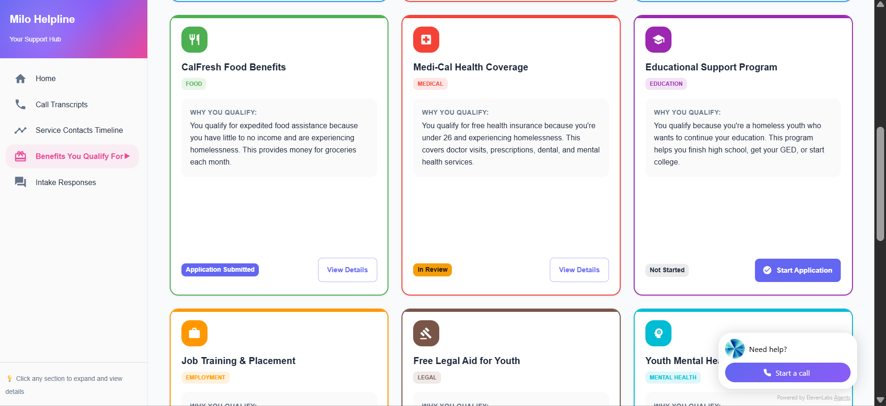

# Milo Helpline - Help Starts Here

An AI-powered, trauma-informed call agent designed to assist homeless youth with empathy and efficiency.

## 📸 Screenshots

### Login Page


_Welcome screen with animated support agent icon and empathetic design_

### Dashboard - Call Transcripts


_View complete conversation histories with AI voice assistant integration_

### Dashboard - Benefits


_Track eligible programs including shelter waitlists, hospital appointments, and emergency housing_

## 🌟 Inspiration

Homeless youth often face impossible barriers when trying to access help. They are asked to repeat painful stories again and again to shelters, hospitals, and hotlines — reliving trauma with every call.

**Milo Helpline** was inspired by Milo, a real leader and advocate who dedicated their life to helping homeless youth find safety, care, and dignity. We wanted to carry their compassion forward by building an AI system that listens, understands, and takes real action — ensuring help truly starts with one call.

## 💬 What it does

Milo Helpline is an AI-powered, trauma-informed call agent designed to assist homeless youth with empathy and efficiency.

- **It talks like a human**, responding with understanding and care.
- **It collects the caller's information once**, so they never have to repeat their story.
- **It automatically fills forms and books appointments** — whether it's finding a shelter bed or arranging hospital care.
- **It provides confirmation details and follow-up messages** to keep the person informed and supported.

In short, Milo Helpline bridges the gap between human compassion and technology — turning every call for help into real, actionable support.

## 🛠️ How we built it

### Frontend Dashboard

- **React 18 + TypeScript**: Modern component-based architecture
- **Material UI v7**: Professional, accessible design system with empathetic color palette
- **Framer Motion**: Smooth animations and transitions
- **React Router v6**: Seamless navigation between login and dashboard
- **ElevenLabs ConvAI Widget**: AI voice assistant integration for 24/7 support


## ✨ Key Features

### Dashboard Features

- **Call Transcripts Panel**: View complete conversation histories with alternating chat layout
- **Service Contacts Timeline**: Track appointments, bookings, and follow-ups
- **Eligible Benefits Card**: Display CalFresh, Medi-Cal, housing vouchers, and more
- **Intake Responses Table**: Organized responses with categories and severity levels
- **Quick Stats**: Real-time overview of calls, appointments, benefits, and status

### AI Voice Assistant

- 24/7 availability through ElevenLabs ConvAI widget
- Trauma-informed conversation design
- Natural language understanding
- Empathetic response generation

### Automation Capabilities

- Automatic form filling for shelter reservations
- Hospital intake form completion
- Emergency housing requests (Category 4 priority)
- Appointment scheduling and confirmations

## 🧩 Challenges we ran into

- **Designing empathetic AI**: Balancing factual intake questions with emotionally sensitive, trauma-informed responses
- **Complex form automation**: Every shelter and hospital website is different; mapping those automatically was challenging
- **Simulating real calls**: Building a natural, two-way conversation between AI and humans required careful prompt tuning and voice handling
- **Deployment hurdles**: Ensuring Playwright's browser automation worked reliably in the Render cloud environment

## 🏆 Accomplishments that we're proud of

- Built and deployed a **fully functional, live AI service** that listens, responds, and acts on behalf of real people in need
- Achieved **end-to-end automation** — from empathetic intake to confirmed bookings
- Created an AI that doesn't just "talk," but **cares** — blending human compassion with automation
- **Honored Milo's legacy** by scaling their life's mission through technology — giving their empathy a voice that can reach thousands

## 📚 What we learned

- **Empathy can be engineered** when we design with humanity at the center
- Social impact AI requires **balancing trust, safety, and compassion** with technical innovation
- **Collaboration** between technologists and human service professionals builds better solutions
- The smallest human-like touches — **tone, phrasing, warmth** — can create massive emotional impact

## 🚀 What's next for Milo Helpline

- **Voice-to-Voice Integration**: Allow callers to speak directly with Milo Helpline 24/7
- **Real-Time Partner APIs**: Connect directly to shelter, hospital, and city databases for instant booking
- **Multilingual Support**: Extend care to non-English-speaking communities
- **Text & Chat Support**: Enable seamless follow-up messages through SMS and WhatsApp
- **Caseworker Dashboard**: A secure backend for social workers to manage and monitor calls for help

Our goal is to make Milo Helpline a **24/7 lifeline for anyone in need** — because help should always start with heart. ❤️

## 🚀 Getting Started

### Prerequisites

- Node.js 18+ and npm/yarn
- Modern web browser

### Installation

```bash
# Clone the repository
git clone

# Install dependencies
npm install

# Start development server
npm run dev
```

The application will be available at `http://localhost:5173`

### Demo Access

For demo purposes:

- Enter any name
- Enter any phone number (format flexible)
- Enter any date of birth

You'll be logged in as a demo user (Rishi Athreya) with sample data.

## 🏗️ Project Structure

```
social-impact-hack/
├── src/
│   ├── components/          # React components
│   │   ├── Login.tsx       # Login page with Milo branding
│   │   ├── Dashboard.tsx   # Main dashboard layout
│   │   ├── Sidebar.tsx     # Navigation sidebar
│   │   ├── CallTranscriptsPanel.tsx
│   │   ├── ServiceContactsTimeline.tsx
│   │   ├── EligibleBenefitsCard.tsx
│   │   └── IntakeResponsesTable.tsx
│   ├── data/
│   │   └── mockData.ts     # Mock data for demo
│   ├── theme.ts            # Material UI theme configuration
│   └── main.tsx            # Application entry point
├── public/                  # Static assets
└── index.html              # HTML template with ElevenLabs widget
```


**Built with ❤️ to honor Milo's legacy and serve homeless youth everywhere**

You can also install [eslint-plugin-react-x](https://github.com/Rel1cx/eslint-react/tree/main/packages/plugins/eslint-plugin-react-x) and [eslint-plugin-react-dom](https://github.com/Rel1cx/eslint-react/tree/main/packages/plugins/eslint-plugin-react-dom) for React-specific lint rules:

```js
// eslint.config.js
import reactX from "eslint-plugin-react-x";
import reactDom from "eslint-plugin-react-dom";

export default defineConfig([
  globalIgnores(["dist"]),
  {
    files: ["**/*.{ts,tsx}"],
    extends: [
      // Other configs...
      // Enable lint rules for React
      reactX.configs["recommended-typescript"],
      // Enable lint rules for React DOM
      reactDom.configs.recommended,
    ],
    languageOptions: {
      parserOptions: {
        project: ["./tsconfig.node.json", "./tsconfig.app.json"],
        tsconfigRootDir: import.meta.dirname,
      },
      // other options...
    },
  },
]);
```
